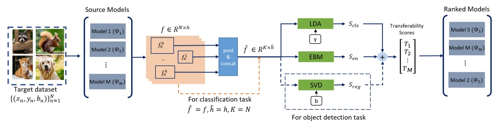

# ETran: Energy-based Transferability Estimation

[](https://colab.research.google.com/drive/1IFpB3-Z99WcmfJG4MEFTrkmdvdHPsYtt?usp=sharing)
[](https://paperswithcode.com/sota/transferability-on-classification-benchmark?p=etran-energy-based-transferability-estimation)


<p align="center">

<p/>

## 1. Setup and package installation
```
pip install torch==1.7.1 torchvision==0.8.2 torchaudio==0.7.2
pip install timm==0.4.9
pip install scipy
pip install -U scikit-learn
pip install tqdm
```

## 2. Download pre-trained models
```
mkdir models/group1/checkpoints
cd models/group1/checkpoints
wget https://download.pytorch.org/models/resnet34-333f7ec4.pth
wget https://download.pytorch.org/models/resnet50-19c8e357.pth
wget https://download.pytorch.org/models/resnet101-5d3b4d8f.pth
wget https://download.pytorch.org/models/resnet152-b121ed2d.pth
wget https://download.pytorch.org/models/mobilenet_v2-b0353104.pth
wget https://download.pytorch.org/models/mnasnet1.0_top1_73.512-f206786ef8.pth
wget https://download.pytorch.org/models/inception_v3_google-1a9a5a14.pth
wget https://download.pytorch.org/models/googlenet-1378be20.pth
wget https://download.pytorch.org/models/densenet121-a639ec97.pth
wget https://download.pytorch.org/models/densenet169-b2777c0a.pth
wget https://download.pytorch.org/models/densenet201-c1103571.pth
```

## 3. Feature Construction

In this step, we will construct features for our target datasets using pre-trained models. The goal is to leverage the power of these models to extract meaningful and discriminative features from our data.

To accomplish this, we will use the `forward_feature.py` script. This script takes as input the name of the target dataset and generates the corresponding features.

Here's how you can use it:

```
python forward_feature.py -d $dataset
```

## 4. Calculating the transferability score for all the target datasets
In this step, we use the transferability metrics to calculate a score for a target dataset using `evaluate_metric.py`. This script takes as input the name of the metric and the name of the target dataset. If you want to reproduce the results of ETran on classification benchmark you need to extract the scores of both 'lda' and 'energy' metrics. You can also reproduce the results of prior work by selecting the metric as 'logme', 'sfda', 'pactran', etc.
```
python evaluate_metric.py -me $metric -d $dataset
```

## 5. Calculating the Kendall τ
In this step, we calculate the Kendall τ using the transferability scores that were obtained in the previous step. Use `tw.py` to obtain the Kendall τ for a metric and a dataset. If you want to reproduce the results of ETran specify 'etran' as the name of the metric to combine the scores of classification, regression, and energy metrics. 

```
python tw.py -me $metric -d $dataset
```

Citation:
```
@inproceedings{gholami2023etran,
  title={ETran: Energy-Based Transferability Estimation},
  author={Gholami, Mohsen and Akbari, Mohammad and Wang, Xinglu and Kamranian, Behnam and Zhang, Yong},
  booktitle={Proceedings of the IEEE/CVF International Conference on Computer Vision},
  pages={18613--18622},
  year={2023}
}
```
